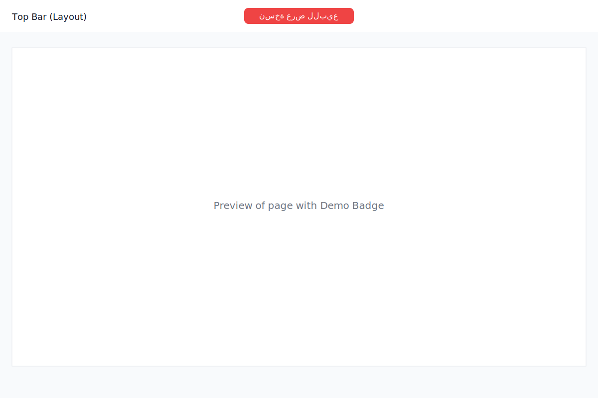

# Munaasib Event Compass App



[](https://munaasib-app.vercel.app) [](https://vercel.com/new/clone?repository-url=https://github.com/Abdulaziz00Ali/munaasib-app)

القيمة المقترحة في سطرين:
- منصّة تربط العملاء مباشرةً بأصحاب القاعات والمطابخ ومزوّدي الخدمات لتجربة حجز سريعة وموثوقة بواجهة عربية متوافقة مع الجوال.
- نوفّر اكتشافًا ذكيًا، تواصلًا فوريًا، وحجوزات مبسطة تدعم نمو المزوّدين وتمنح العملاء راحة وشفافية.

مزيد من التفاصيل والعرض الحي متاح عبر صفحة المستثمرين داخل التطبيق: انتقل إلى المسار المحلي /investors بعد تشغيل الخادم.

A React-based event planning application for managing venues, halls, kitchens, and other event-related services. The application is built with a focus on Arabic language support and RTL layout.

## روابط سريعة

- النسخة الحية: https://munaasib-app.vercel.app
- نطاق العرض (اختياري): https://demo.munaasib.app
- مسارات التحقق: `/investors`, `/privacy`, `/terms`, `/vendor`, `/category`

## Prerequisites

- Node.js (v16 or higher)
- npm (v7 or higher)

## Installation

```sh
# Clone the repository
git clone <REPOSITORY_URL>

# Navigate to the project directory
cd munaasib-event-compass-app

# Install dependencies
npm i
```

## Development

```sh
# Start the development server
npm run dev
```

The development server will start at `http://localhost:5173` by default.

## Building for Production

```sh
# Build the project for production
npm run build
```

The build output will be in the `dist` directory.

## Automated Photos Pipeline

The application includes an automated pipeline for downloading, optimizing, and managing venue images:

```sh
# Run the automated photos pipeline
npm run automated-photos
```

This script will:

1. Extract venue data from the application's data files
2. Download images from Google Maps for each venue
3. Optimize the images for web use (resizing, compression)
4. Generate WebP versions for modern browsers
5. Copy optimized images to the production build directory

The images will be stored in three locations:
- `public/halls and kitchens images/` - Original downloaded images
- `public/optimized-images/` - Optimized JPG and WebP versions
- `dist/optimized-images/` - Production-ready optimized images

## Environment Variables

Create a `.env` file in the root directory with the following variables:

```
# Enable demo mode
VITE_DEMO_MODE=true

# WhatsApp contact number (international format, digits only, no +, spaces, or dashes)
# Example: 966500000000 (for KSA mobile)
VITE_WHATSAPP_NUMBER=966500000000
```

### Environment Variables Description

- `VITE_DEMO_MODE`: Set to `true` to enable demo mode.
- `VITE_WHATSAPP_NUMBER`: WhatsApp contact number used for customer support and demo flows. Use international format as digits only (no symbols), e.g., 9665XXXXXXXX.

## Deployment

### Deploying to Netlify

1. Push your code to a Git repository (GitHub, GitLab, or Bitbucket)
2. Log in to Netlify and click "New site from Git"
3. Select your repository and configure the following settings:
   - Build command: `npm run build`
   - Publish directory: `dist`
4. Add the environment variables in the Netlify dashboard under Site settings > Environment variables
5. Enable SPA routing by creating a `_redirects` file in the `public` directory with:
   ```
   /* /index.html 200
   ```
   or by adding the following to `netlify.toml` in the root directory:
   ```toml
   [[redirects]]
     from = "/*"
     to = "/index.html"
     status = 200
   ```

### Deploying to Vercel

1. Push your code to a Git repository
2. Log in to Vercel and click "New Project"
3. Import your repository and configure the following settings:
   - Framework Preset: Vite
   - Build command: `npm run build`
   - Output directory: `dist`
4. Add the environment variables in the Vercel dashboard under Settings > Environment Variables
5. Configure SPA routing by adding a `vercel.json` file in the root directory:
  ```json
  {
     "rewrites": [{ "source": "/(.*)", "destination": "/index.html" }]
  }
  ```

#### Live Demo
- Production: `https://munaasib-app.vercel.app`
- Preview/Custom Domain (اختياري): `https://demo.munaasib.app`

Add your DNS `CNAME` to point `demo.munaasib.app` to `cname.vercel-dns.com`.

## Technologies Used

- Vite - Fast build tool and development server
- TypeScript - Type-safe JavaScript
- React - UI library
- shadcn-ui - UI component library
- Tailwind CSS - Utility-first CSS framework
- React Router - Client-side routing

## Features

- Venue browsing and filtering
- Category-based navigation (Halls, Kitchens, etc.)
- Responsive design for mobile and desktop
- RTL support for Arabic language
- Google Maps integration for venue locations

## Screenshots
- راجع `sale-pack/SCREENSHOT_SHOTLIST.md` لقائمة اللقطات المقترحة.
- أمثلة صور توضيحية داخل `screenshots/`:
  - `whatsapp-button.svg`
  - `map-placeholder.svg`
  - `no-results-message.svg`

## GitHub Repository Description (للوصف أعلى الصفحة)

Munaasib — تطبيق عربي لاكتشاف وحجز القاعات والمطابخ ومزوّدي الخدمات في المملكة والخليج. واجهة RTL، فلترة ذكية، وروابط واتساب فورية للتواصل والحجز. جاهز للنشر على Vercel مع صفحات قانونية وSEO عربي.

يمكنك نسخ هذا الوصف إلى خانة "Description" في صفحة المستودع على GitHub.

## Sale Pack (للمشترين)
- تم إضافة حزمة بيع جاهزة في `sale-pack/`:
  - `SALE_MEMO.md`: مذكرة بيع شاملة.
  - `ASSET_LIST.md`: قائمة الأصول المنقولة.
  - `OPERATIONS_GUIDE.md`: دليل التشغيل السريع (ديمو/بناء/نشر).
  - `DEMO_PITCH.md`: خطاب عرض مختصر للمراسلة.
- `SCREENSHOT_SHOTLIST.md`: قائمة اللقطات المطلوبة وأحجام الشاشة.

## Checklist للتحقق السريع
- يعمل على `Vercel` مع إعادة كتابة SPA عبر `vercel.json`.
- روابط قانونية: `/privacy` و`/terms` موجودة في `Navbar` و`Footer`.
- بيئة العرض: `VITE_DEMO_MODE=true` و`VITE_WHATSAPP_NUMBER=9665XXXXXXXX` موثقة في `.env.example`.
- مسارات رئيسية فعّالة: `/vendor`, `/investors`, `/category`.
